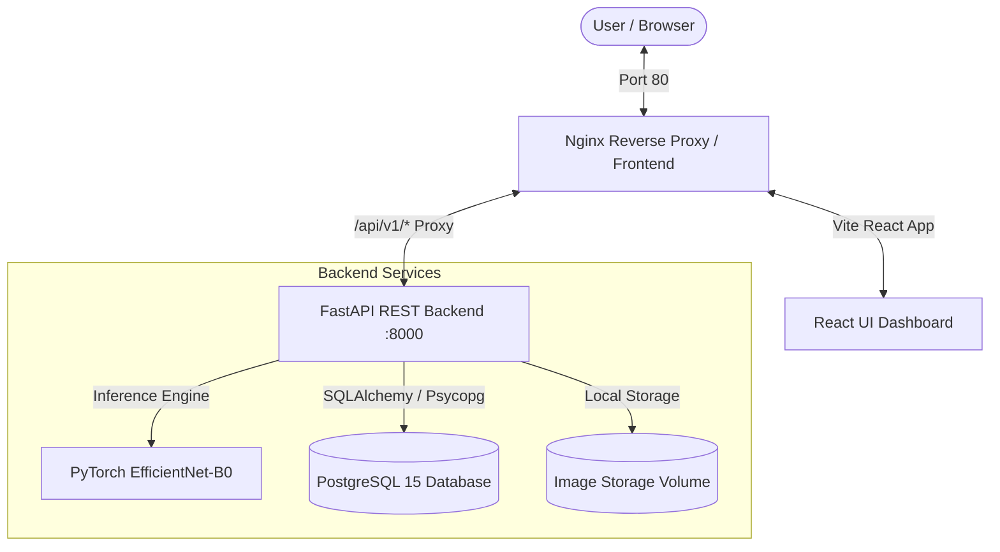

# 🌱 EcoVision AI — Smart Waste Classification & Disposal Intelligence Platform

[](https://www.python.org/)
[](https://fastapi.tiangolo.com/)
[](https://pytorch.org/)
[](https://reactjs.org/)
[](https://www.postgresql.org/)
[](https://www.docker.com/)

**EcoVision AI** is an intelligent, full-stack waste classification and disposal intelligence system designed to automate waste segregation, promote recycling efficiency, and provide actionable ecological guidance through computer vision.

Powered by a fine-tuned **EfficientNet-B0** deep convolutional neural network, a robust **FastAPI** backend, **PostgreSQL** persistence, and an interactive **React** frontend.

---

## 📑 Table of Contents

- [Key Features](#-key-features)
- [System Architecture](#-system-architecture)
- [Repository Structure](#-repository-structure)
- [Waste Classification Taxonomy](#-waste-classification-taxonomy)
- [Quick Start with Docker Compose](#-quick-start-with-docker-compose)
- [Local Development Setup](#-local-development-setup)
  - [Backend Setup](#1-backend-setup)
  - [Frontend Setup](#2-frontend-setup)
  - [ML Model Pipeline](#3-ml-model-pipeline)
- [API Reference](#-api-reference)
- [ML Architecture & Training](#-ml-architecture--training)
- [Testing & Quality Assurance](#-testing--quality-assurance)
- [Team & Acknowledgments](#-team--acknowledgments)

---

## 🌟 Key Features

- 📸 **Instant Image Classification**: Upload or capture waste item photos to receive sub-second classification across 8 waste categories.
- 🎯 **Confidence Breakdown**: Complete probability distribution and softmax scores across all potential categories.
- ♻️ **Actionable Disposal Guidance**: Contextual recycling instructions, appropriate bin allocations (e.g., Blue, Green, Yellow), and material-specific preparation tips.
- 📊 **Analytics Dashboard**: Real-time waste metrics, category distribution, total items sorted, and recycling impact tracking.
- 📜 **Historical Audit Log**: Complete history of past classifications with search, filtering, and timestamp records.
- 🐳 **Production-Ready Containerization**: Fully orchestrable via Docker Compose with automated database migrations and health checks.

---

## 🏗️ System Architecture



---

## 📁 Repository Structure

```text
The_Brokers-Waste_Classification/
├── backend/                       # FastAPI REST API backend
│   ├── app/
│   │   ├── ai/                    # ML model loading & inference engine
│   │   ├── core/                  # Security, logging, and application configuration
│   │   ├── database/              # SQLAlchemy database session & engine
│   │   ├── models/                # Database ORM models
│   │   ├── routes/                # API endpoints (classify, history, analytics, categories)
│   │   ├── schemas/               # Pydantic validation schemas
│   │   ├── services/              # Business logic & disposal recommendations
│   │   └── main.py                # FastAPI entrypoint
│   ├── alembic/                   # Database migrations
│   ├── tests/                     # Unit & integration test suites
│   ├── Dockerfile                 # Backend production container
│   └── requirements.txt           # Python dependencies
├── Frontend/                      # React frontend application
│   ├── src/
│   │   ├── components/            # Reusable UI components (Navbar, Cards, Charts)
│   │   ├── pages/                 # Main views (Home, Classify, History, Analytics)
│   │   ├── services/              # Axios API clients
│   │   └── App.jsx                # Router & root component
│   ├── nginx.conf                 # Production Nginx reverse proxy configuration
│   ├── Dockerfile                 # Multi-stage frontend container
│   └── package.json               # Node.js dependencies & scripts
├── ml/                            # Machine Learning & Deep Learning pipeline
│   ├── data/                      # Dataset manifests & raw images
│   ├── src/
│   │   ├── dataset.py             # PyTorch Dataset, splits & augmentations
│   │   ├── model.py               # EfficientNet-B0 architecture definition
│   │   ├── train.py               # Training loop with Cosine Annealing & metrics
│   │   ├── evaluate.py            # Test evaluation & confusion matrix generation
│   │   └── metrics.py             # Accuracy, precision, recall & macro F1
│   └── artifacts/                 # Saved weights (best_model.pt) & training history
├── docker-compose.yml             # Multi-container orchestration
└── README.md                      # Project documentation
```

---

## 🏷️ Waste Classification Taxonomy

EcoVision AI categorizes waste into **8 distinct classes**:

| Category | Typical Items | Recommended Bin | Actionable Tip |
| :--- | :--- | :--- | :--- |
| **Plastic** | Bottles, tubs, bags, containers | 🔵 Blue / Plastic Bin | Rinse residue and flatten before disposal. |
| **Paper** | Newspapers, office paper, envelopes | 🔵 Blue / Paper Bin | Keep clean and dry; do not mix with food waste. |
| **Cardboard** | Shipping boxes, cereal cartons | 🔵 Blue / Paper Bin | Flatten completely to conserve bin capacity. |
| **Glass** | Jars, beverage bottles, glass food jars | 🟢 Green / Glass Bin | Rinse thoroughly; remove lids if metal or plastic. |
| **Metal** | Aluminum soda cans, tin food cans, foil | 🟡 Yellow / Metal Bin | Clean out food residue; crush cans if possible. |
| **Organic** | Food scraps, peels, yard trimmings | 🟤 Brown / Compost Bin | Keep free of plastic stickers and packaging. |
| **E-Waste** | Cables, batteries, circuit boards, phones | 🔴 Dedicated E-Waste | Drop off at certified electronic recycling hubs. |
| **Other** | Non-recyclable composites, ceramics, dust | ⚫ Black / General Waste | Bag securely for standard landfill disposal. |

---

## 🚀 Quick Start with Docker Compose

The fastest way to launch the complete EcoVision AI platform (Postgres, Backend, and Frontend) is using Docker Compose:

### 1. Clone the repository
```bash
git clone https://github.com/vaibhavmangla07/The_Brokers-Waste_Classification.git
cd The_Brokers-Waste_Classification
```

### 2. Start all services
```bash
docker compose up --build -d
```

### 3. Access the platform
- **Web UI**: [http://localhost](http://localhost) (Port 80)
- **FastAPI Interactive Docs**: [http://localhost:8000/docs](http://localhost:8000/docs)
- **API Health Check**: [http://localhost:8000/health](http://localhost:8000/health)

### 4. Stop the services
```bash
docker compose down
```

---

## 💻 Local Development Setup

If you prefer to run services individually for local development and debugging:

### 1. Backend Setup

```bash
cd backend

# Create and activate virtual environment
python3 -m venv .venv
source .venv/bin/activate  # On Windows: .venv\Scripts\activate

# Install dependencies
pip install -r requirements.txt

# Configure environment variables
cp .env.example .env
# Update DATABASE_URL in .env if running local Postgres

# Run database migrations
alembic upgrade head

# Start development server
uvicorn app.main:app --reload --host 0.0.0.0 --port 8000
```

### 2. Frontend Setup

```bash
cd Frontend

# Install npm dependencies
npm install

# Start development server (with Vite HMR)
npm run dev
```
The frontend dev server will be accessible at `http://localhost:5173`.

### 3. ML Model Pipeline

To inspect, train, or evaluate the classifier:

```bash
cd ml

# Train model with data augmentation and Cosine Annealing
python src/train.py

# Evaluate test split and print classification metrics
python src/evaluate.py
```

---

## 🔌 API Reference

### 1. Waste Classification
- **Endpoint**: `POST /api/v1/classify`
- **Content-Type**: `multipart/form-data`
- **Payload**: `file` (image file: JPG, PNG, WEBP)
- **Response**:
```json
{
  "classification_id": "a9d701fc-3d27-4a0b-9671-55c91b1c67d8",
  "category": "cardboard",
  "confidence": 0.942,
  "probabilities": {
    "cardboard": 0.942,
    "paper": 0.038,
    "plastic": 0.012,
    "metal": 0.003,
    "glass": 0.002,
    "organic": 0.001,
    "e-waste": 0.000,
    "other": 0.000
  },
  "disposal": {
    "bin_type": "Recyclable / Paper & Cardboard",
    "instructions": "Flatten boxes completely to save space and keep dry.",
    "recyclable": true,
    "environmental_impact": "Recycling 1 ton of cardboard saves 9 cubic yards of landfill space."
  },
  "created_at": "2026-10-01T15:00:00Z"
}
```

### 2. Supported Categories
- **Endpoint**: `GET /api/v1/categories`
- **Description**: Returns all 8 supported classes with their default disposal guidelines.

### 3. Classification History
- **Endpoint**: `GET /api/v1/history?page=1&limit=10`
- **Description**: Paginated list of historical classifications.

### 4. Analytics Summary
- **Endpoint**: `GET /api/v1/analytics/summary`
- **Description**: Total scans, recyclable ratio, and waste breakdown stats.

---

## 🧠 ML Architecture & Training

The AI engine utilizes a transfer learning approach on **EfficientNet-B0**:
- **Backbone**: Pretrained ImageNet feature extractor with fine-tuned top layers.
- **Classifier Head**:
  - `Linear(1280, 512)`
  - `BatchNorm1d(512)`
  - `SiLU` activation
  - `Dropout(p=0.35)`
  - `Linear(512, 8)`
- **Data Augmentations**:
  - Random Resized Crop (`224x224`)
  - Random Horizontal & Vertical Flip
  - Random Affine (Rotation $\pm 20^\circ$, Translation, Scaling)
  - Color Jitter (Brightness, Contrast, Saturation)
  - Random Erasing for occlusion robustness
- **Loss Function**: Cross-Entropy Loss with Label Smoothing ($\alpha = 0.1$).
- **Optimization**: AdamW with Weight Decay ($1\times 10^{-4}$) & Cosine Annealing Learning Rate Scheduler.

---

## 🧪 Testing & Quality Assurance

Run the automated backend test suite covering endpoints, ML inference mock checks, and database models:

```bash
cd backend
pytest tests/ -v
```

---

## 👥 Team & Acknowledgments

Developed with ❤️ by **The Brokers** team for smarter waste management and sustainable environmental stewardship.
